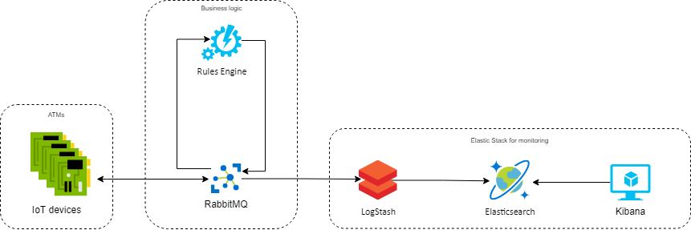
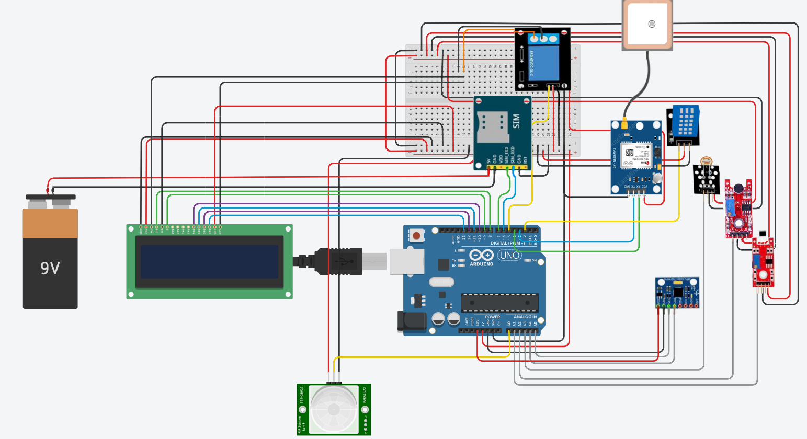

# Auriga.WWSToaster

## Description
A simple Arduino project for a prototype of IoT security device for ATMs. Let's see some examples of ATM attacks that this project aims to tackle. 

### ATM Jackpotting
It is a sophisticated crime in which thieves install malicious software and/or hardware on ATMs that forces the machines to dispense huge volumes of cash on demand.
1. Gain physical internal access to an ATM through the top-hat of the terminal.
2. Use an endscope instrument to locate internal portion of the cash machine.
3. Attach a cord that allows them to sync their device to the ATM’s computer.
4. Use a keyboard or device to access the ATM’s computer.
5. Install the ATM Malware.
6. Collect cash with money mule.

This is a summarized attack process and it is not an absolute methodology to ATM attacking. 

#### Scenario 1 - Rules
- **Rule 1:** Temperature over 59°C + Brightness under 400
- **Rule 2:** Noise under 500 + Brightness under 400
- **Rule 3:** Temperature over 59°C + Motion detected
- **Rule 4:** Noise under 500 + Motion detected
- **Rule 5:** Jammer detected under 400 or over 600 (**offline** rule)

When one of this rules is satisfied the ATM must be switched off.

### Physical Attack
Another simple and frequent attack, especially in Apulia, is about the physical removing of ATM from the site. This is called Physical Attack. Physical attacks on ATMs are considered risky, as it not only leads to financial losses but also involves the risk to property and life. The physical attack usally involves solid and gas explosives attacks, along with physical removal of ATMs from the site and later using other techniques to gain access to the cash dispenser and safe.

#### Scenario 2 - Rules
- **Rule 1:** GPS movement detected
- **Rule 2:** Gyroscope over 10000 + Accelerometer over 10000

When one of this rules is satisfied the ATM must be switched in a "GPS only" mode. In this mode we have to send only GPS data and more often then usual.

### Other types of Attacks
There are other types of attacks like Man-in Middle attack, Data Sniffing Attacks, Skimming with Spoofing. Those attacks target customers instead of banks. 

## Architecture
The following diagram shows the architecture that must be implemented in order to satisfy the project's requirements. Basically, it is composed of three parts.
- The IoT devices located on the ATMs (Arduino).
- A message broker used to communicate with a backend that implements the business logic (RabbitMQ).
- A module for system monitoring (Elastic Stack).

## Arduino
### Devices
- [Modulo GSM GSM GPRS SIM800L](https://www.amazon.it/gp/product/B07X2634ZQ/ref=ox_sc_act_title_1?smid=A2BQVM41SWSLKR&psc=1)
- [Aideepen 2PCS GY-GPS6MV2 NEO-6M Modulo di Posizione Modulo GPS](https://www.amazon.it/gp/product/B08CZSL193/ref=ox_sc_act_title_2?smid=AUN6EYX254ETV&psc=1)
- [AZDelivery Jumper Wire Cavetti](https://www.amazon.it/gp/product/B074P726ZR/ref=ox_sc_act_title_3?smid=A1X7QLRQH87QA3&psc=1)
- [Elegoo Progetto Starter Kit Basic](https://www.amazon.it/gp/product/B06XSFF7MG/ref=ox_sc_act_title_4?smid=AZF7WYXU5ZANW&psc=1)
- [Elegoo 37-in-1 Kit Modulo Sensore Elettronici](https://www.amazon.it/gp/product/B01N79PG4G/ref=ox_sc_act_title_5?smid=AZF7WYXU5ZANW&psc=1)
- [Caricabatterie USB Amazon da 5](https://www.amazon.it/gp/product/B01J2G52O6/ref=crt_ewc_title_dp_1?ie=UTF8&psc=1&smid=A11IL2PNWYJU7H)
- [POSUGEAR Power Bank 10000mAh](https://www.amazon.it/gp/product/B07WVVTK86/ref=crt_ewc_title_dp_2?ie=UTF8&psc=1&smid=A1F8R6XWWYQ81U)

Sensors and modules used are listed below:

Device Name | Description | Image |
----------- | ---- | ---- |
| DHT11 | Temperature and humidity  | |
Light Dependent Resistor (KY-018)| Light sensitive device to indicate the presence or absence of light || 
Small sound (KY-038)| High sensitivity microphone | |
Linear hall (KY-024)| Magnetic field sensor |  |
GY-521 (MPU6050) | Gyroscope and accelerometer | |
HC SR501 PIR Sensor | Simple motion sensor | |
GPS (6MV2) | GPS tracker module | |
GSM (SIM800L evb) | GSM/GPRS sim module |  |
LCD (liquid crystal) | 2 rows x 16 columns LCD | 

### Schematics
In order to ensure the full compatibility with our project, we suggest you to apply a wiring following our schematics.

## RabbitMQ

After you installed RabbitMQ you should already have the following default exchange (which is the default exchange for MQTT communication), if not you must create a new exchange with the following attributes:
- **Name**: amq.topic
- **Type**: topic
- **Durability**: true

If you want to use AMQP, instead of MQTT, you can use this exchange or you can also create your own.

In the following table all queues configurations are described.

Queue Name | Type | Durability | Args | Binding | Description |
------------ | ------------- | ------------- | ------------- | ------------- | ------------- |
**q_brightness**| classic| true | | atm.darkness.* | Queue which interacts with Brightness sensor.  Value goes from 0 LIGH to 1023 DARK |
**q_electromagnetic-field** | classic| true | | atm.linearhall.* | Queue which interacts with LinearHall sensor.  Value goes from 0 to 1023 |
**q_gps** | classic| true | | atm.gps.* | Queue which interacts with GPS module.  Values are Latitude and Longitude |
**q_gyroscope** | classic| true | | atm.gyro.* | Queue which interacts with Gyroscope sensor.  Values are from   Gyroscope --> X Y Z and Accelerometer --> X Y Z |
**q_microphone** | classic| true | | atm.microphone.* | Queue which interacts with Small Sound sensor.  Value goes from 0 to 1023 |
**q_motion** | classic| true | | atm.motion.* | Queue which interacts with Motion sensor.  Value are 1, if movement is detected, 0 instead. |
**q_temp-humidity** | classic| true | | atm.temperature.* | Queue which interacts with DHT sensor.  Value goes from  -25 to 68 °C for Temperature and  from 20 to 90 % for Humidity |
**q_sensors** | classic| true | | atm.# | Queue gets data from all sensors and it's used for Monitoring purpose. |

**N.B.**: For MQTT communications you **MUST** use **'/'** instead of **'.'** in the routing keys.

## Elastic Stack

1. [Elastic Installation Guide](https://github.com/lorenzokyne/Auriga-IoT-Project/tree/main/Elasticsearch)
2. [Kibana Installation Guide](https://github.com/lorenzokyne/Auriga-IoT-Project/tree/main/Kibana)
3. [Logstash Installation Guide](https://github.com/lorenzokyne/Auriga-IoT-Project/tree/main/Logstash)

