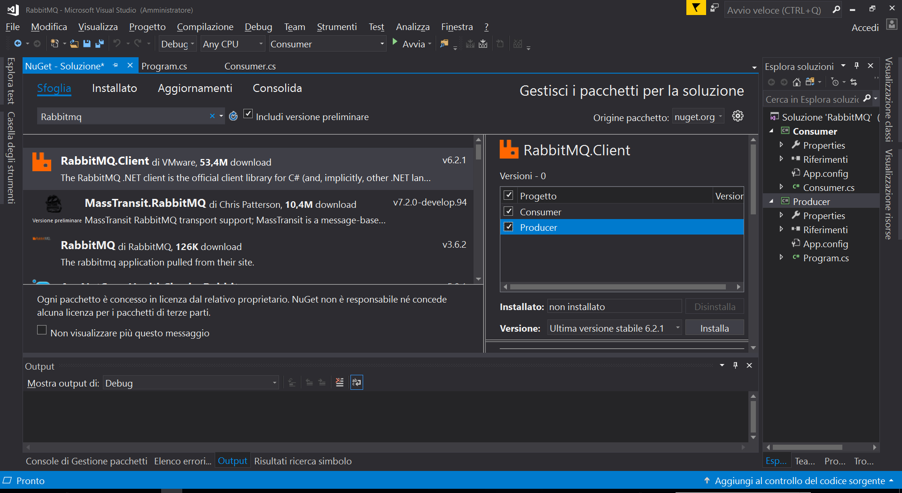

# **RabbitMQ – Windows Installation steps** 

Requirements 

- Windows (/w chocolatey package manager for windows installed) 
- Visual Studio (or VSCode or similar IDE) 
- Internet connection 

Steps 

## 1. **Install[ Using chocolatey** ](https://www.rabbitmq.com/install-windows.html#chocolatey)**

RabbitMQ packages are[ distributed via Chocolatey.](https://chocolatey.org/packages/rabbitmq) New releases can take a while (sometimes weeks) to get through approvals, so this option is not guaranteed to provide the latest release. It does, however, manage the required dependencies. 

To install RabbitMQ using Chocolatey, run the following command from the command line or from PowerShell: 

choco install rabbitmq 

When it asks to accept, type ‘A’ 

Do you want to run the script?([Y]es/[A]ll - yes to all/[N]o/[P]rint): A 

This will enable you to have a broker on your machine. 

RabbitMQ rise as Windows service, you can start/stop it by the ‘service’ tab 

RabbitMQ service provide server side management console that can be useful to understand how it does creates queues and binds them to exchanges. 

Local address[ http://localhost:15672/ ](http://localhost:15672/)- user: guest pwd: guest 

In order to develop clients (both producers and consumers) we need a library for our programming language. 

We choose C# but it is possible to develop RabbitMQ clients in a wide range of programming languages. 

- [Python ](https://www.rabbitmq.com/tutorials/tutorial-five-python.html)
- [Java ](https://www.rabbitmq.com/tutorials/tutorial-five-java.html)
- [Ruby ](https://www.rabbitmq.com/tutorials/tutorial-five-ruby.html)
- [PHP ](https://www.rabbitmq.com/tutorials/tutorial-five-php.html)
- [C# ](https://www.rabbitmq.com/tutorials/tutorial-five-dotnet.html)
- [JavaScript ](https://www.rabbitmq.com/tutorials/tutorial-five-javascript.html)
- [Go ](https://www.rabbitmq.com/tutorials/tutorial-five-go.html)
- [Elixir ](https://www.rabbitmq.com/tutorials/tutorial-five-elixir.html)
- [Objective-C ](https://www.rabbitmq.com/tutorials/tutorial-five-objectivec.html)
- [Swift ](https://www.rabbitmq.com/tutorials/tutorial-five-swift.html)
- [Spring AMQP ](https://www.rabbitmq.com/tutorials/tutorial-five-spring-amqp.html)
## 2. **Create a new C# solution (we have named It ‘RabbitMQ’)** 
## 3. **Create a c# console project and name it ‘Producer’** 
## 4. **Create a c# console project and name it ‘Consumer’** 
## 5. **Install ‘RabbitMQ’ library from nuget package manager (on both projects)** 

  YOU ARE NOW ABLE TO WRITE YOUR RABBITMQ clients! 
